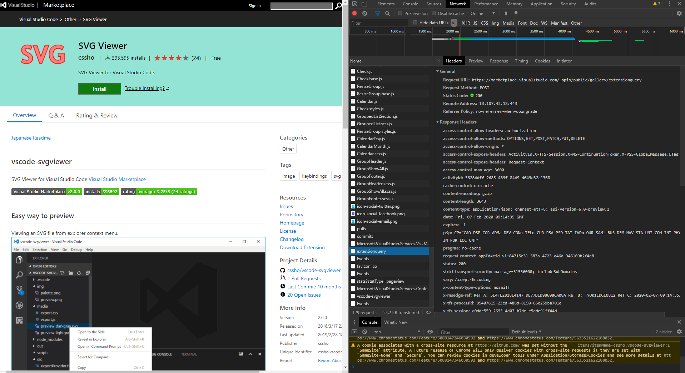
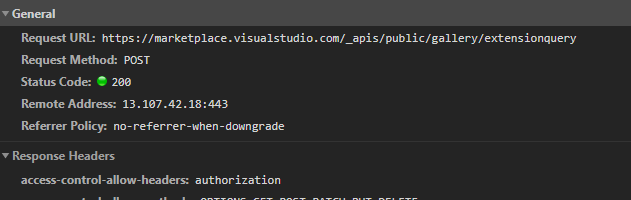
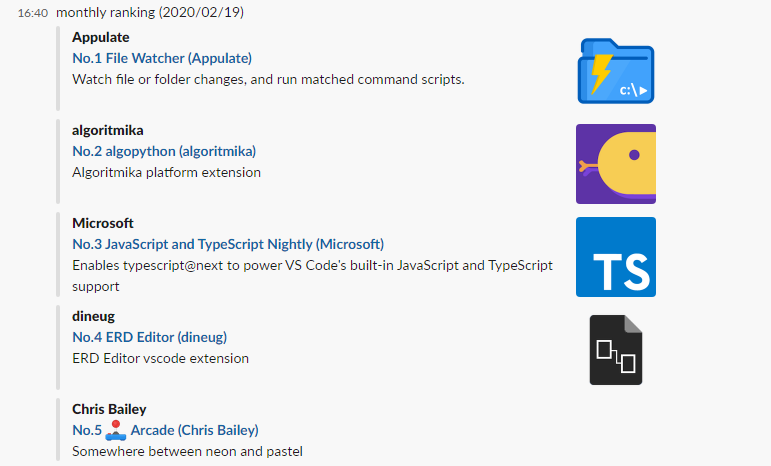
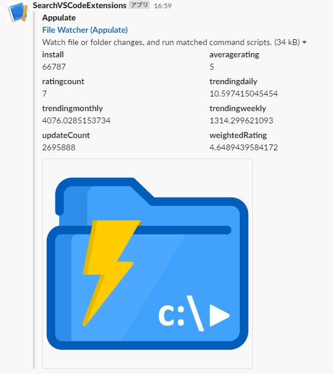

# Extension\(を検索するAPI\)を使う

VS Code Meetup #3 - Extensionを使う編

---

# 自己紹介

## 佐藤 翔 (Sato Sho)

 [cssho (@csshooo)](https://twitter.com/csshooo) /  [cssho (Sho Sato)](https://github.com/cssho)

### 所属: [株式会社ヒューマンテクノロジーズ](https://www.h-t.co.jp/)

### 趣味: 猫とお酒

---

# VSCode関連でやっていること

## [VSMarketplaceBadge](https://vsmarketplacebadge.apphb.com/)

Visual Studio Marketplaceのアイテム対象のバッジ表示サービス。

[](https://marketplace.visualstudio.com/items?itemName=cssho.vscode-svgviewer) [](https://marketplace.visualstudio.com/items?itemName=cssho.vscode-svgviewer) [](https://marketplace.visualstudio.com/items?itemName=cssho.vscode-svgviewer)

---

## [SVG Viewer](https://marketplace.visualstudio.com/items?itemName=cssho.vscode-svgviewer)
SVGのプレビューやエクスポートができる
VSCodeの機能拡張

**メンテナ募集中！**
**というかまるっと管理してくれる人大募集！**

---

# Extensionを検索するAPI とは
Visual Studio Marketplace内のアイテムを検索できるAPI

---

# VSCodeでも

[vscode/extensionGalleryService.ts L501-L506](https://github.com/microsoft/vscode/blob/525b43fc009f0a27d70e3eeb80efb6694dbe225f/src/vs/platform/extensionManagement/common/extensionGalleryService.ts#L501-L506)

```
return this.requestService.request({
    type: 'POST',
    url: this.api('/extensionquery'),
    data,
    headers
}, token).then(context => {
```

---

# Marketplaceでも



---

# 仕様
多分ドキュメントにはまとめられていない
VSCodeのソースコード等を参考に読み解いていく
[vscode/extensionGalleryService.ts](https://github.com/microsoft/vscode/blob/525b43fc009f0a27d70e3eeb80efb6694dbe225f/src/vs/platform/extensionManagement/common/extensionGalleryService.ts)

---

## Endpoint
https://marketplace.visualstudio.com/_apis/public/gallery/extensionquery

## HTTP Method
`POST`

---

## HTTP Header
- Content-Type: `application/json`
- Accept: `application/json;api-version=3.0-preview.1`

---

## [Flags](https://github.com/microsoft/vscode/blob/525b43fc009f0a27d70e3eeb80efb6694dbe225f/src/vs/platform/extensionManagement/common/extensionGalleryService.ts#L77-L90)
レスポンスに関する諸条件

```ts
enum Flags {
	None = 0x0,
	IncludeVersions = 0x1,
	IncludeFiles = 0x2,
	IncludeCategoryAndTags = 0x4,
	IncludeSharedAccounts = 0x8,
	IncludeVersionProperties = 0x10,
	ExcludeNonValidated = 0x20,
	IncludeInstallationTargets = 0x40,
	IncludeAssetUri = 0x80,
	IncludeStatistics = 0x100,
	IncludeLatestVersionOnly = 0x200,
	Unpublished = 0x1000
}
```

---

## [FilterType](https://github.com/microsoft/vscode/blob/525b43fc009f0a27d70e3eeb80efb6694dbe225f/src/vs/platform/extensionManagement/common/extensionGalleryService.ts#L96-L105)
検索条件

```ts
enum FilterType {
	Tag = 1, ExtensionId = 4,
	Category = 5, ExtensionName = 7,
	Target = 8, Featured = 9,
	SearchText = 10, ExcludeWithFlags = 12
}
```

---

## [SortBy](https://github.com/microsoft/azure-devops-extension-api/blob/master/src/Gallery/Gallery.ts#L1729-L1785)
ソート順（ここだけVSCodeのソースでカバーしきれておらずAzure DevOpsの機能拡張向けAPIのソースを参照）

```ts
export enum SortByType {
    Relevance = 0,　LastUpdatedDate = 1,
    Title = 2,　Publisher = 3,
    InstallCount = 4, PublishedDate = 5,
    AverageRating = 6,　TrendingDaily = 7,
    TrendingWeekly = 8,　TrendingMonthly = 9,
    ReleaseDate = 10,　Author = 11,
    WeightedRating = 12
}
```

---

## Example

ExtensionNameが `cssho.vscode-svgviewer` のアイテムの情報を統計情報を含めて取得するクエリ

```json
{
    "filters": [{
            "criteria": [{
                    "filterType": 7, // ExtensionNameが
                    "value": "cssho.vscode-svgviewer"
            }]
    }],
    "flags": 256
}
```

<!--
POST https://marketplace.visualstudio.com/_apis/public/gallery/extensionquery HTTP/1.1
content-type: application/json
accept: application/json;api-version=3.0-preview.1

{
    "filters": [
        {
            "criteria": [
                 {
                    "filterType": 7,
                    "value": "cssho.vscode-svgviewer"
                }
            ]
        }
    ],
    "flags": 256
}
-->

---

# 実際に実行してみると…

---

# VSCodeの機能拡張で今日のトレンドTOP5

```
{
    "filters": [{
            "criteria": [{
                    "filterType": 8, // ターゲット
                    "value": "Microsoft.VisualStudio.Code"
            }],
            "pageSize": 5, // 5件
            "sortBy": 7 // 今日のトレンド
    }]
}
```

<!--
POST https://marketplace.visualstudio.com/_apis/public/gallery/extensionquery HTTP/1.1
content-type: application/json
accept: application/json;api-version=3.0-preview.1

{
    "filters": [
        {
            "criteria": [
                {
                    "filterType": 8,
                    "value": "Microsoft.VisualStudio.Code"
                }
            ],
            "pageSize": 5,
            "sortBy": 7
        }
    ]
}
-->

---

## という感じでランキング的<br>なのも取れるので

- 定期的にランキング垂れ流したり
- お気に入りのExtensionの更新をウォッチしたり
- 自分の作ったExtensionの統計データを集計してみたり

---

# ということでちゃちゃっと[Bot](https://gist.github.com/cssho/f5b5af53561f00616ec4c74d59a9a77d)<br>作ってみました

Google Apps Script + Slack App

---



<!--
/ranking daily
/ranking weekly
/ranking monthly
-->

---



<!--
/statics cssho.vscode-svgviewer
-->

---

## 人より一足先に便利なExtensionを使いたいそこのあなた！
## 是非このAPI触ってみてください！

---

# 最後に大事なことなのでもう一度言います

---

# [SVG Viewer](https://marketplace.visualstudio.com/items?itemName=cssho.vscode-svgviewer)<br>のオーナー募集中！